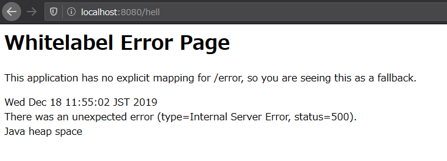
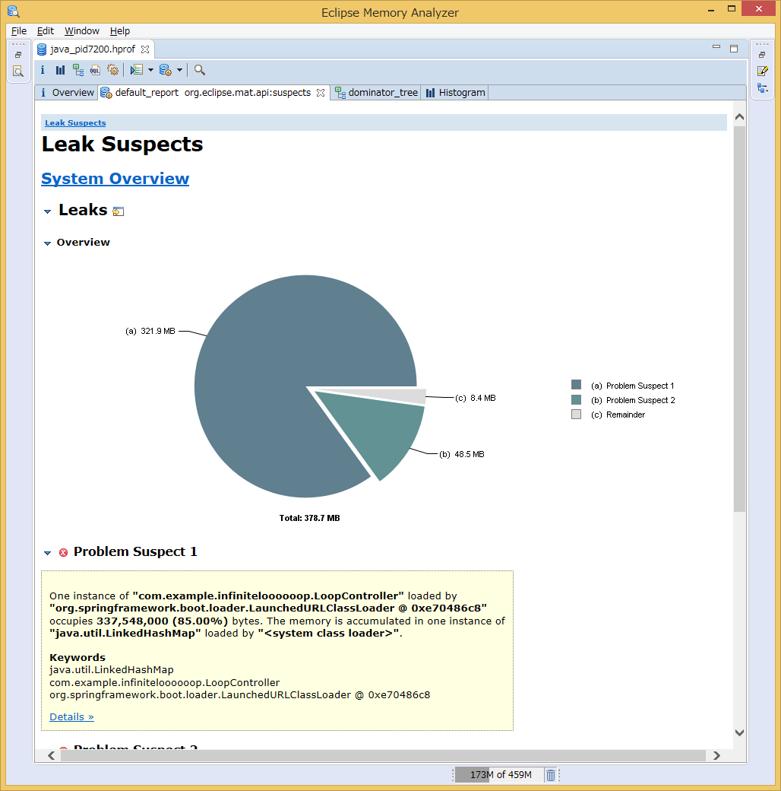
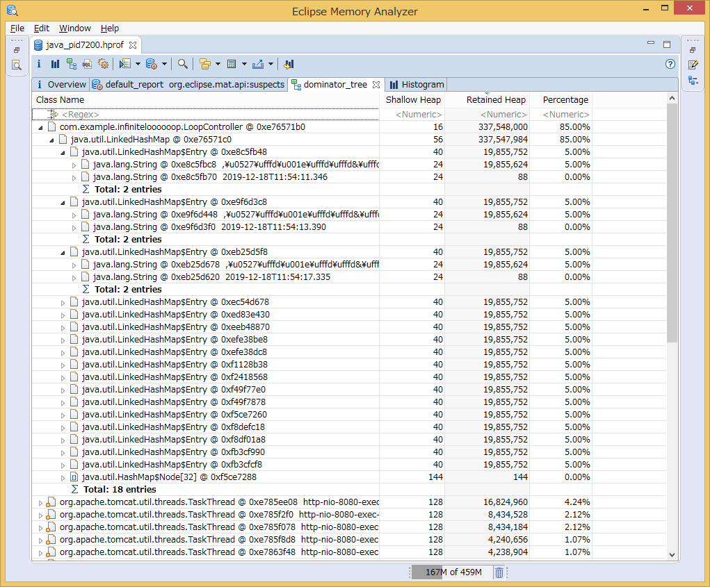

# タイトル
Koltinでもトラブル解析してみたい!

# タグ
Koltin,

# 本文

## 予定

デッドロックによるスタック
および
無限ループによるOOM

上記のトラブル解析をしてみる

トラブル例
https://www.ulsystems.co.jp/topics/039

` cat /dev/urandom | head -c 20m > test.txt`

jvisualvm(jdk1.8)

$ java -Xmx500m -XX:+HeapDumpOnOutOfMemoryError -XX:HeapDumpPath=/Users/ykonno/Src/qiita-article/ -jar build/libs/infinite-loooooop-0.0.1-SNAPSHOT.jar

これらをKotlinクラス、Javaクラスそれぞれでつくってみたい

解析方法
https://qiita.com/FSMS/items/8239e61d7fbbd4cca5c4

## 本稿

## やりたいこと
KotlinもJVM言語ですので、Javaと同じ障害時の解析手順が使えるか気になったため、
まずはヒープダンプ・スレッドダンプを出力、解析してみました。

## 環境
```console
Windows x64

$ java -version
java version "1.8.0_191"
Java(TM) SE Runtime Environment (build 1.8.0_191-b12)
Java HotSpot(TM) 64-Bit Server VM (build 25.191-b12, mixed mode)
 
$ javac -version
javac 1.8.0_191

$ kotlinc -version
info: kotlinc-jvm 1.3.50 (JRE 1.8.0_191-b12)
```

## 手順
```console
$ java -Xmx400m -XX:+HeapDumpOnOutOfMemoryError -jar build/libs/infinite-loooooop-0.0.1-SNAPSHOT.jar

  .   ____          _            __ _ _
 /\\ / ___'_ __ _ _(_)_ __  __ _ \ \ \ \
( ( )\___ | '_ | '_| | '_ \/ _` | \ \ \ \
 \\/  ___)| |_)| | | | | || (_| |  ) ) ) )
  '  |____| .__|_| |_|_| |_\__, | / / / /
 =========|_|==============|___/=/_/_/_/
 :: Spring Boot ::        (v2.2.2.RELEASE)

2019-12-18 11:53:00.078  INFO 7200 --- [           main] c.e.i.InfiniteLoooooopApplicationKt      : Starting InfiniteLoooooopApplicationKt on PC with PID 7200 (\infinite-loooooop-0.0.1-SNAPSHOT.jar started by PC in path)
2019-12-18 11:53:00.087  INFO 7200 --- [           main] c.e.i.InfiniteLoooooopApplicationKt      : No active profile set, falling back to default profiles: default
2019-12-18 11:53:04.983  INFO 7200 --- [           main] o.s.b.w.embedded.tomcat.TomcatWebServer  : Tomcat initialized with port(s): 8080 (http)
2019-12-18 11:53:05.021  INFO 7200 --- [           main] o.apache.catalina.core.StandardService   : Starting service [Tomcat]
2019-12-18 11:53:05.022  INFO 7200 --- [           main] org.apache.catalina.core.StandardEngine  : Starting Servlet engine: [Apache Tomcat/9.0.29]
2019-12-18 11:53:05.451  INFO 7200 --- [           main] o.a.c.c.C.[Tomcat].[localhost].[/]       : Initializing Spring embedded WebApplicationContext
2019-12-18 11:53:05.452  INFO 7200 --- [           main] o.s.web.context.ContextLoader            : Root WebApplicationContext: initialization completed in 5180 ms
2019-12-18 11:53:06.697  INFO 7200 --- [           main] o.s.s.concurrent.ThreadPoolTaskExecutor  : Initializing ExecutorService 'applicationTaskExecutor'
2019-12-18 11:53:07.229  INFO 7200 --- [           main] o.s.b.w.embedded.tomcat.TomcatWebServer  : Tomcat started on port(s): 8080 (http) with context path ''
2019-12-18 11:53:07.246  INFO 7200 --- [           main] c.e.i.InfiniteLoooooopApplicationKt      : Started InfiniteLoooooopApplicationKt in 8.075 seconds (JVM running for 9.133)
```

起動しました。

ここで`localhost:8080/hell` へ繰り返しリロードしてアクセスしてみます

しばらく繰り返すとError画面が返ってきました。


コンソールにもOutOfMemoryが発生し、ヒープダンプが出力されたことを示すログが出ています。
```console
2019-12-18 11:54:10.511  INFO 7200 --- [nio-8080-exec-1] o.a.c.c.C.[Tomcat].[localhost].[/]       : Initializing Spring DispatcherServlet 'dispatcherServlet'
2019-12-18 11:54:10.512  INFO 7200 --- [nio-8080-exec-1] o.s.web.servlet.DispatcherServlet        : Initializing Servlet 'dispatcherServlet'
2019-12-18 11:54:10.528  INFO 7200 --- [nio-8080-exec-1] o.s.web.servlet.DispatcherServlet        : Completed initialization in 15 ms
java.lang.OutOfMemoryError: Java heap space
Dumping heap to java_pid7200.hprof ...
Heap dump file created [411821043 bytes in 17.902 secs]
2019-12-18 11:54:58.000 ERROR 7200 --- [io-8080-exec-10] o.a.c.c.C.[.[.[/].[dispatcherServlet]    : Servlet.service() for servlet [dispatcherServlet] in context with path [] threw exception [Handler dispatch failed; nested exception is java.lang.OutOfMemoryError: Java heap space] with root cause

java.lang.OutOfMemoryError: Java heap space
        at java.util.Arrays.copyOf(Arrays.java:3332) ~[na:1.8.0_191]
        at java.lang.AbstractStringBuilder.ensureCapacityInternal(AbstractStringBuilder.java:124) ~[na:1.8.0_191]
        at java.lang.AbstractStringBuilder.append(AbstractStringBuilder.java:596) ~[na:1.8.0_191]
        at java.lang.StringBuffer.append(StringBuffer.java:367) ~[na:1.8.0_191]
        at java.io.StringWriter.write(StringWriter.java:94) ~[na:1.8.0_191]
        at kotlin.io.TextStreamsKt.copyTo(ReadWrite.kt:125) ~[kotlin-stdlib-1.3.61.jar!/:1.3.61-release-180 (1.3.61)]
        at kotlin.io.TextStreamsKt.copyTo$default(ReadWrite.kt:120) ~[kotlin-stdlib-1.3.61.jar!/:1.3.61-release-180 (1.3.61)]
        at kotlin.io.TextStreamsKt.readText(ReadWrite.kt:107) ~[kotlin-stdlib-1.3.61.jar!/:1.3.61-release-180 (1.3.61)]
```

それではヒープダンプを[Eclipse Memory Analyzer](https://www.eclipse.org/mat/)で見てみます。



